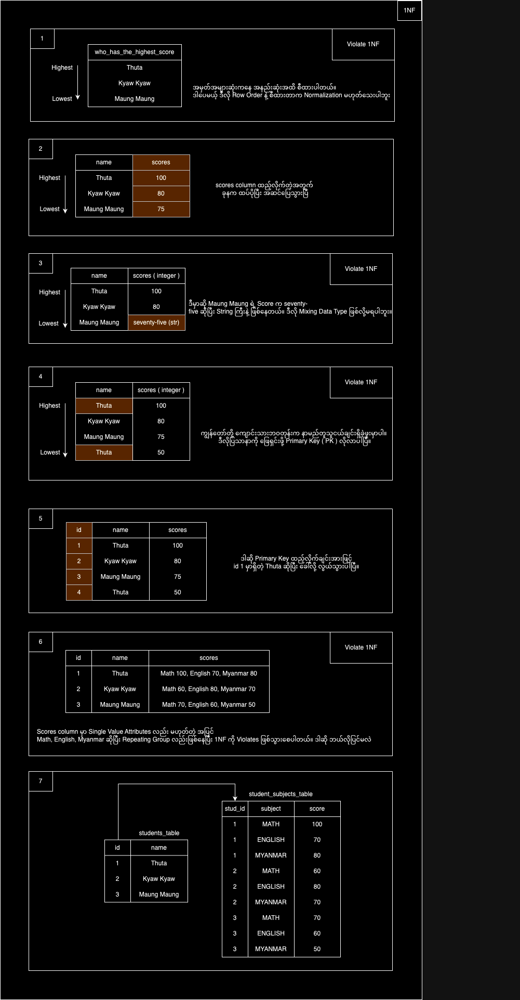
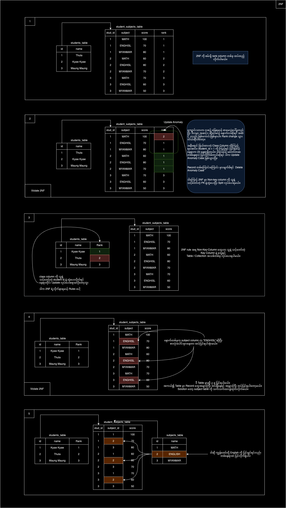
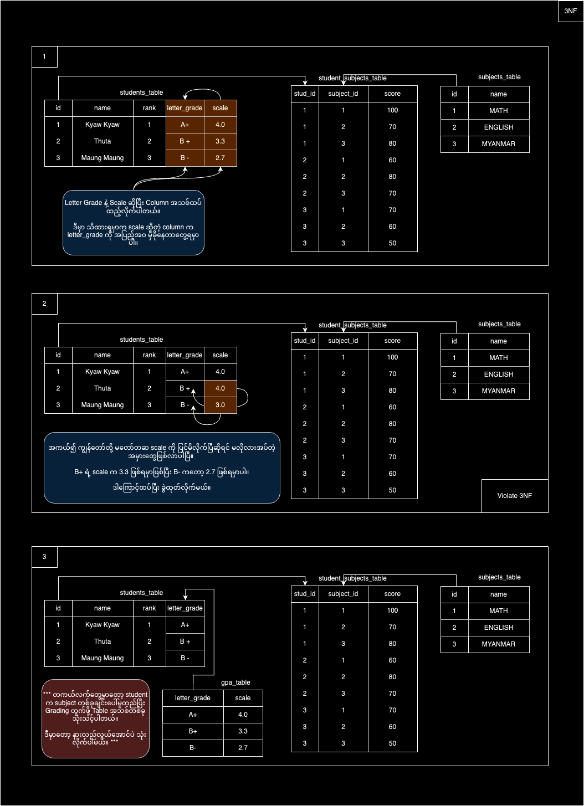
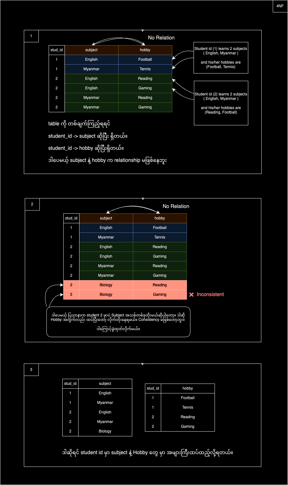

Content
1. What is Normalization?
2. Normal Form
	1. First Normal Form ( 1NF )
	2. Second Normal Form ( 2NF )
	3. Third Normal Form ( 3NF )
	4. BCNF ( Boyce-Codd Normal Form / 3.5 Normal Form )
	5. Fourth Normal Form ( 4NF )
	6. Fifth Normal Form ( 5NF )

------------------------------------------------------------------------

1. What is Normalization?
   
   Normalization တို့ Denormalization တို့ စကားလုံးတွေကို လေ့လာတဲ့ နေရာမှာ တကယ်တမ်းမှာက သင်ကြားရေး Video ကြည့်တာထပ်၊ Article ဆောင်းပါတွေလိုက်ရှာဖတ်တာထပ်၊ တကယ်လက်တွေ့ လုပ်ကြည့်လိုက်တာ ပိုပြီးလွယ်ကူတယ်။ မယုံမရှိနဲ့ တကယ်ပါ။  သိသလောက် အတတ်နိုင်ဆုံး ရှင်းအောင်ပြောပြသွားမယ်။ 
   
   Database ကို သုံးဖူးတဲ့ သူတွေ၊ အလုပ်လုပ်ဖူးတဲ့ သူတွေ ဆိုရင်တော့ ဒီအခေါ်အဝေါ်တွေကို ကြားဖူးနားဝ ရှိပါလိမ့်မယ်။ **Normalize** နဲ့ **Denormalize** ဆိုတာက data modeling နဲ့ပတ်သက်တဲ့ အဓိက concepts တွေဖြစ်ပါတယ်။ 
   
   Software တစ်ခု Project တစ်ခု လုပ်တဲ့ အခါမှာ Data Modeling Concept က အရေးအကြီးဆုံး အပိုင်းဖြစ်ပါတယ်။​ Database Relationship တွေအတွက် Normalization စဥ်းစားပုံမှားတာနဲ့ ကျွန်တော်တို့ develop လုပ်တဲ့ အချိန်မှာ တိုင်ပတ်ပါပြီ။ 
   
   >****Normalization**** is the process of minimizing ****redundancy**** from a relation or set of relations
   
   **Redundancy** ဆိုတာ ကျွန်တော်တို့မှာရှိတဲ့ Attributes (data) တစ်ခုက Table 1 ခုထဲမှာ (သို့) 2 ခု 3 ခုမှာ ထပ်ခါတစ်လဲလဲပါနေပြီဆိုရင်၊ တစ်နည်းအားဖြင့် Data ထပ်နေပြီဆိုရင် Consistancy မရှိတော့ပဲ ၊ တစ်ခုပြင်ချင်ပြီဆို အကုန်လုံးမှာလိုက်ပြင်ရတာမျိုး ဖြစ်လာပါတယ်။
   
   ဒါကြောင့် Normalization စဥ်းစားပုံက အရေးကြီးတဲ့ အပိုင်းဖြစ်လာပါတယ်။ Normalization လုပ်တဲ့ နေရမှာ Form 6 မျိုးရှိပေမယ့် တကယ် သုံးတဲ့ Concepts ကတော့ Form 3 မျိုး (1NF, 2NF, 3NF) ပဲ သိရင် လုံလောက်ပါတယ်။ ကျွန်တော်ကတော့ 6 မျိုးလုံးပြောပြထားပါတယ်။ ကဲ ဒါဆို Form တွေကို တစ်ချက်လေ့လာရအောင်။
   
   Notes : Normalization အများကြီးလုပ်မိရင်လည်း Performance Issue တွေ ဖြစ်လာနိုင်ပါတယ်။ 
    
------------------------------------------------------------------------
2. Normal Form
       
    **Normal Forms** (NF) ဆိုတာ Relational Database Design မှာ data ကို proper structure ထားဖို့အသုံးပြုတဲ့ **guidelines** မျိုးဖြစ်ပါတယ်။ အဓိကရည်ရွယ်ချက်က data redundancy နဲ့ anomalies (အမှားအယွင်း) ကိုလျှော့ချပြီး, တိကျမှန်ကန်ဖို့ ပါ။ Normal form ကို အဆင့်အလိုက်ခွဲကြည့်လို့ရပါတယ်။
       
    1. First Normal Form ( 1NF )
          
          1NF က Form တွေအားလုံးထဲမှာ အခြေခံအကျဆုံး Form ဖြစ်ပါတယ်။ 1NF Rules တွေကတော့ 
          
          - Data Field တစ်ခုမှာ Single Data တစ်ခုသာရှိရမယ်။ 
          - Column နာမည်တွေကလည်း Unique ဖြစ်နေရမယ်။ ( ဥပမာ : နာမည်တို့ အသက်တို့ )
          - Column တစ်ခုအတွင်းမှာ Mixing Data Type မဖြစ်ရဘူး။ ( Column က Integer ပဲ လက်ခံမယ်ဆိုပေမယ့် တစ်ချို့ Value တွေက String ဖြစ်)
          - Repeating groups (data redundancy) မရှိရ။
          - Row တစ်ခုရဲ့ Information (value) တွေ မှာ သက်ဆိုင်ရာ Unique Key ( Primary Key )ရှိရမယ်။ 
            
          ဥပမာပုံကို ကြည့်ရင် ရှင်းသွားပါလိမ့်မယ်။
          
          

		---------------------------------------------------------------
    2. Second Normal Form ( 2NF )
          
         >All Data must depend on the Primary Key.
          
          2NF Rule ကကျတော့ 
          - ကိုယ့် Table မှာ Non-Key-columns ( Key လို့ သတ်မှတ်လို့မရတဲ့ ) ရှိလား အရင်ရှာမယ်။
          - အဲ့ဒီ Non-Key-columns နဲ့ Key Columns ( PK or FK ) တွေနဲ့ သင့်တော်လား။ သင့်တော်ရင် Table / Collections တစ်ခုခွဲပြီး သပ်သပ်စီ ထားပေးမယ်။ ဥပမာ ပုံကြည့်ရအောင်
            
         

		---------------------------------------------------------------
    3. Third Normal Form ( 3NF )

		 The Primary Key must fully depend all Non-Key columns and Non-Key columns must not depend on any other Key.
		   
		  
		   
		 ဆိုကြပါဆို့ ကျွန်တော်တို့ Letter Gradeပေါ်မူတည်ပြီး GPA Scale score တွက်ကြည့်ကြပါမယ်။​ 2NF က table ကိုပဲ ဆက်သုံးပါမယ်။

		 
		
		---------------------------------------------------------------
    4. BCNF ( Boyce-Codd Normal Form / 3.5 Normal Form )
       
		Rules: 
          - The table should be in the 3rd Normal Form.
          - X should be a superkey for every functional dependency (FD) X−>Y in a given relation.
		   
		 BCNF မှာ Functional Dependency များဟာ Candidate Key ကိုသာ အခြေပြုထားရမယ်။ ဥပမာအားဖြင့် Table ရဲ့ Field တစ်ခုက တခြား Field တစ်ခုကို သတ်မှတ်နေတဲ့အခါ၊ အဲဒီ Field (သို့) Field Group က Table ရဲ့ Candidate Key ဖြစ်ရမယ်။
		   
		 ဒါဆို Candidate Key တို့ Functional Dependency ကို တစ်ချက်အရင်ရှင်းပြပါမယ်။​
		 
		 

		 ဒါဆို BCNF ကို တစ်ချက်ဆက်လေ့လာရအောင်
		 
		 

		---------------------------------------------------------------
    5. Fourth Normal Form ( 4NF )
	    
         Rules: 
         
	      - it must be in BCNF.
	      - A table should not have Multi-Valued Dependencies.
		   
	     Multi-Valued Dependencies ဆိုတာကို ပြောရရင် ဆိုကြပါစို့ 
		 ကျွန်တော်တို့မှာ Column A, B, C ဆိုပြီး သုံးခုရှိတယ်။ Column A က Primary Key လို့ယူဆရအောင်။ 
		   
		 A ->-> ထဲမှာ တစ်ခုထပ်ပိုပြီး Dependent B value တွေရှိနိုင်တယ်။ 
		 ထိုနည်းလည်းကောင်းပဲ A ->-> ထဲမှာ C values တွေရှိနိုင်တယ်။ ဒါပေမယ့် Column B နဲ့ Column C ကတော့ Independent ဖြစ်နေမယ်။ 
		   
		 ဒီလို Column တစ်ခုထဲမှာ Independent ရော Dependent ရောဖြစ်နေရင် Multi-valued dependencies လို့ မှတ်ထားလို့ရပါတယ်။ ဥပမာ ပုံကြည့်ရအောင်။ 
		   
		 
		
		---------------------------------------------------------------
    6. Fifth Normal Form ( 5NF )
	      
	      Rules : 
	      
	      - Relation must be in Fourth Normal Form.
	      - The relation must not be further non loss decomposed.
	        
	     4NF မှာက Multi-Valued Dependencies ကို Handled နိုင်တယ်ဆိုရင် 5NF မှာက Join Dependencies ကို Handled လုပ်ပေးပါတယ်။ Food Ordering Process ကို နာမူနာထားပြီး ကြည့်ရအောင်။
	     
	     
	      
   
------------------------------------------------------------------------