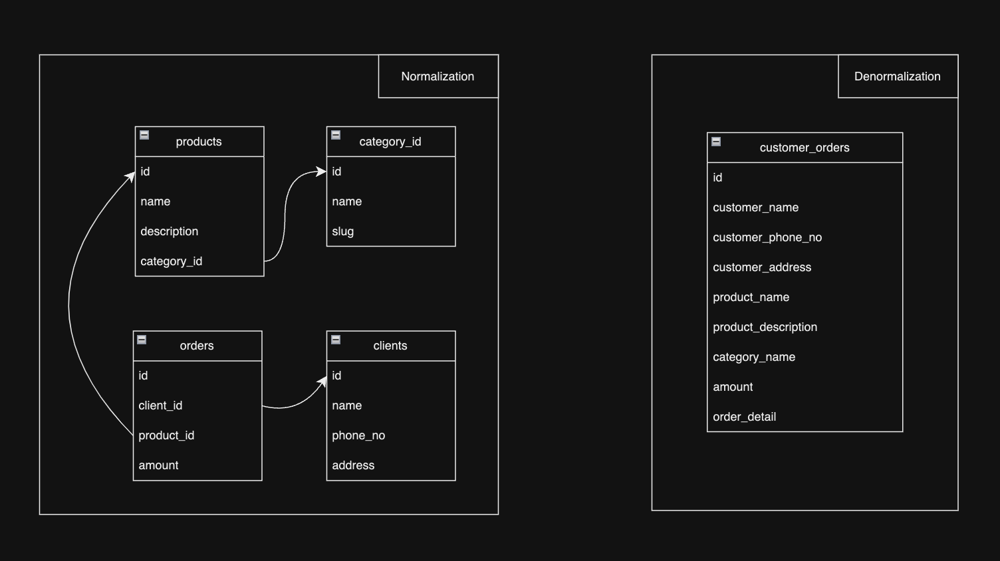

## Content

1. What is Denormalization?
2. Conclusion

---

### 1. What is Denormalization?

   Denormalization ဆိုတာက Normalization ရဲ့ ပြောင်းပြန် ဖြစ်ပါတယ်။ Normalization က Redundant Column တွေကို ခွဲထုတ်တယ်။ Denormalization ကတော့ အဲဒီ ခွဲထုတ်ထားတဲ့ Columns တွေကို ပြန်ပေါင်းထည့်တယ်။ ဒါကြောင့် Denormalization ကို Database Optimization Technique တစ်ခုလို့လည်း ခေါ်ကြပါတယ်။

   Normalization လုပ်ထားတာက အချက်အလက် ထပ်မထည့်အောင် ထိန်းထားပေးပြီး အဆင်ပြေပါတယ်၊ ဒါပေမယ့် ရလာတဲ့ပြဿနာက Table အများကြီးကနေ Data တွေကို ပြန်စုစည်းဖို့ Join Query ပြုလုပ်နေရတတ်ပါတယ်။ Denormalization လုပ်တဲ့အခါမှာတော့ Query ပေါင်းစပ်ချက် မဖြစ်စေချင်တဲ့ Data တွေကိုတစ်ခါတည်း Tables တစ်ခုထဲမှာ ထည့်ထားတာကြောင့် ပိုပြီးမြန်ဆန်ပါတယ်။

   ဥပမာကို တစ်ချက်ကြည့်ပါ။

   

   Customer Orders ကိုရဖို့ Table 4 ခုလောက် ပတ်ယူနေစရာ မလိုတော့ပါဘူး။ ဒီလိုနဲ့ Query Performance ပိုမြန်လာတာကို တွေ့မြင်ရမှာပါ။

---

### 2. Conclusion

   Normalization နဲ့ Denormalization တွေက Data Modeling Concepts ဖြစ်ကြတာမို့ အကြောင်းအရာတစ်ခုတည်းမှာလည်း မူတည်ပါတယ်။ Project သုံးမယ့် အမျိုးအစားနဲ့ Database Architecture အပေါ်မူတည်ပြီး Normalization, Denormalization တို့ကို အသုံးပြုသင့်ပါတယ်။

---
