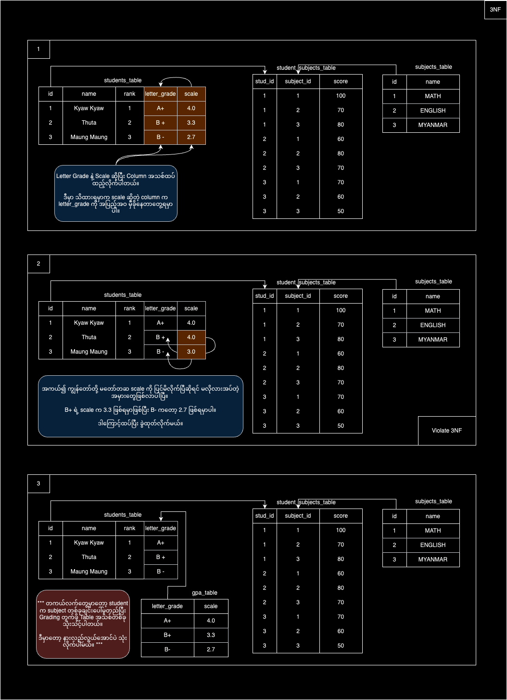
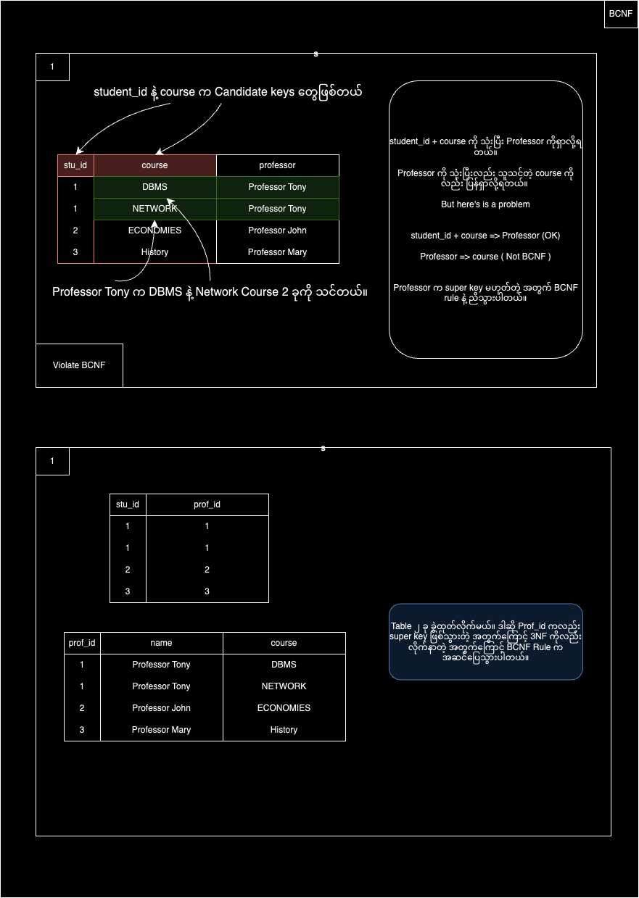
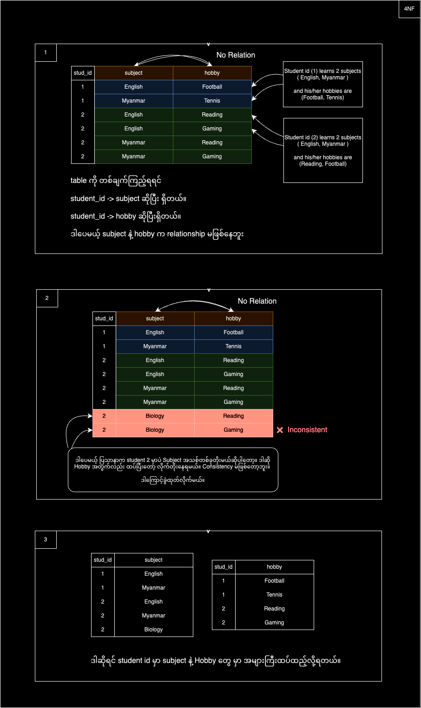
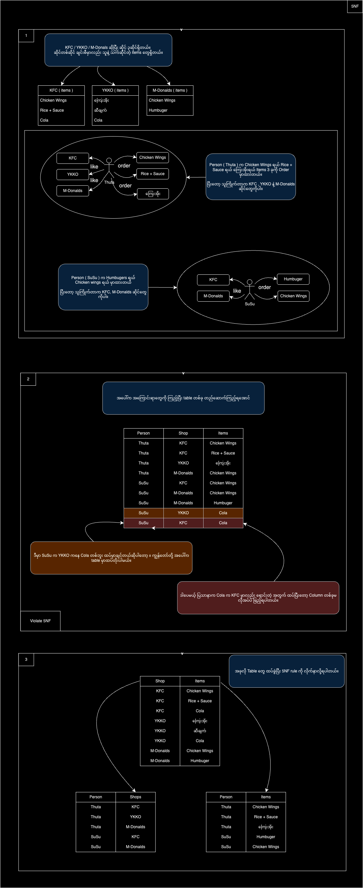

## Contents
1. What is Normalization?
2. Normal Forms
   - First Normal Form (1NF)
   - Second Normal Form (2NF)
   - Third Normal Form (3NF)
   - BCNF (Boyce-Codd Normal Form / 3.5 Normal Form)
   - Fourth Normal Form (4NF)
   - Fifth Normal Form (5NF)

---

## 1. What is Normalization?

Normalization နှင့် Denormalization ဆိုတဲ့စကားလုံးတွေကို လေ့လာတဲ့အခါ Database Concept တွေကိုနားလည်ဖို့အတွက် လက်တွေ့လုပ်ကြည့်ရင် ပိုလွယ်ပါတယ်။ Database ကိုသုံးဖူးတဲ့လူတွေ သိကြတဲ့ **Normalize** နဲ့ **Denormalize** ဆိုတာက data modeling နဲ့ပတ်သက်တဲ့ အဓိက concepts တွေဖြစ်ပါတယ်။

> **Normalization** is the process of minimizing **redundancy** in a relation or set of relations.

**Redundancy** ဆိုတာ Attributes တစ်ခုမှာ data တူတာတွေ ထပ်နေနိုင်ခြင်းပါ။ ဒါကြောင့် Normalization လုပ်ခြင်းက အရေးကြီးပါတယ်။ ထုံးစံအရ Normalization Forms အများကြီးရှိပေမဲ့ ပုံမှန်အနေဖြင့် 1NF, 2NF, နဲ့ 3NF ကိုသိရုံလုံလောက်ပါတယ်။ 

**Note**: Normalization ကို အများကြီးလုပ်ရင်လည်း Performance Issue တွေ ဖြစ်နိုင်ပါတယ်။

---

## 2. Normal Forms

**Normal Forms (NF)** ဆိုတာ Relational Database Design မှာ data ကို proper structure နဲ့ထားဖို့အတွက် အသုံးပြုတဲ့ **guidelines** တွေဖြစ်ပါတယ်။ အဓိကရည်ရွယ်ချက်က data redundancy နဲ့ anomalies (အမှားအယွင်း) ကိုလျှော့ချဖို့ပါ။

### 1. First Normal Form (1NF)

1NF က အခြေခံဖြစ်တဲ့ Form ဖြစ်ပါတယ်။ 1NF ရဲ့ Rules တွေကတော့:
- Data Field တစ်ခုမှာ Single Data တစ်ခုသာ ရှိရမယ်။
- Column နာမည်တွေက Unique ဖြစ်ရမယ်။
- Column တစ်ခုမှာ Mixed Data Types မသွားရ။
- Repeating groups မရှိရ။
- Row တစ်ခုမှာ Primary Key ရှိရမယ်။

ဥပမာပုံကြည့်ပါ။

---

### 2. Second Normal Form (2NF)

> All Data must depend on the Primary Key.

2NF ရဲ့ Rule က:
- Non-Key-columns (Key မဟုတ်တဲ့ Columns) တွေကို ရှာပါ။
- Non-Key-columns တွေမှာ Key Columns (PK or FK) တွေနဲ့ သင့်တော်ရင် သပ်သပ်ထားပေးပါ။ 

ဥပမာပုံကို ကြည့်ပါ။

---

### 3. Third Normal Form (3NF)

> The Primary Key must fully depend on all Non-Key columns, and Non-Key columns must not depend on any other Key.

ဥပမာ - Letter Grade နဲ့ GPA Scale ကို အသုံးပြုထားတဲ့ ပုံကြည့်ပါ။

---

### 4. BCNF (Boyce-Codd Normal Form / 3.5 Normal Form)

Rules:
- The table should be in 3rd Normal Form.
- Functional dependencies X−>Y တွေအားလုံးအတွက် X က Superkey ဖြစ်ရမယ်။

BCNF မှာ Functional Dependency များဟာ Candidate Key ကိုသာ အခြေပြုထားရမယ်။ ဥပမာအားဖြင့် Table ရဲ့ Field တစ်ခုက တခြား Field တစ်ခုကို သတ်မှတ်နေတဲ့အခါ၊ အဲဒီ Field (သို့) Field Group က Table ရဲ့ Candidate Key ဖြစ်ရမယ်။

Candidate Key နဲ့ Functional Dependency ကို ရှင်းပြပါမယ်။

---

### 5. Fourth Normal Form (4NF)

Rules:
- Table သည် BCNF ဖြစ်ရမယ်။
- Table တွင် Multi-Valued Dependencies မရှိရဘူး။

Multi-Valued Dependencies ဆိုတာကို ပြောရရင် ဆိုကြပါစို့ ကျွန်တော်တို့မှာ Column A, B, C ဆိုပြီး သုံးခုရှိတယ်။ Column A က Primary Key လို့ယူဆရအောင်။

A ->-> ထဲမှာ တစ်ခုထပ်ပိုပြီး Dependent B value တွေရှိနိုင်တယ်။ ထိုနည်းလည်းကောင်းပဲ A ->-> ထဲမှာ C values တွေရှိနိုင်တယ်။ ဒါပေမယ့် Column B နဲ့ Column C ကတော့ Independent ဖြစ်နေမယ်။

ဒီလို Column တစ်ခုထဲမှာ Independent ရော Dependent ရောဖြစ်နေရင် Multi-valued dependencies လို့ မှတ်ထားလို့ရပါတယ်။ ဥပမာ ပုံကြည့်ရအောင်။

---

### 6. Fifth Normal Form (5NF)

Rules:
- Relation မှာ Fourth Normal Form ဖြစ်ရမယ်။
- The relation must not be further non-loss decomposed.

4NF မှာက Multi-Valued Dependencies ကို Handled နိုင်တယ်ဆိုရင် 5NF မှာက Join Dependencies ကို Handled လုပ်ပေးပါတယ်။ Food Ordering Process ကို နာမူနာထားပြီး ကြည့်ရအောင်။

---

This concludes the Normal Forms explanation.
