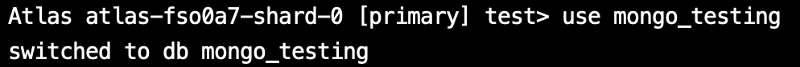
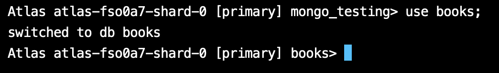
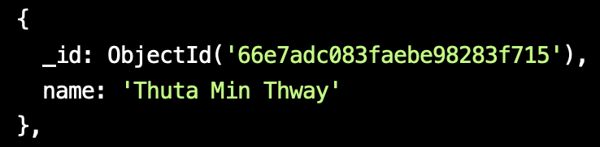
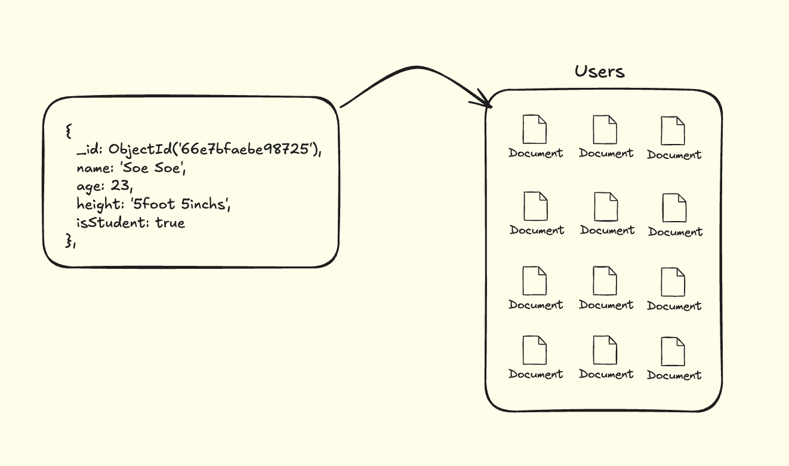
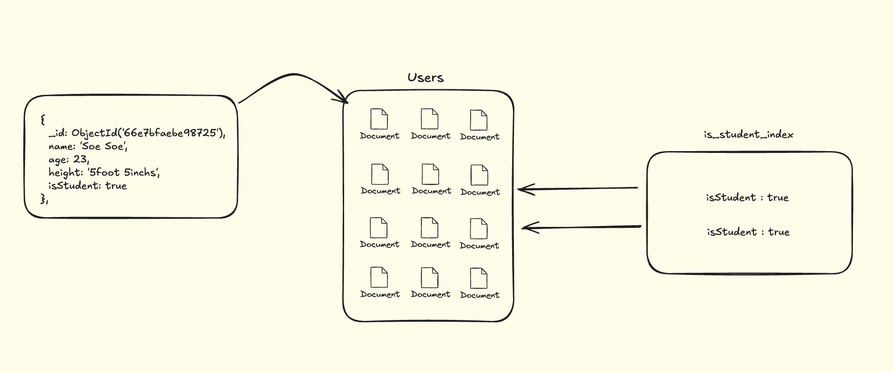
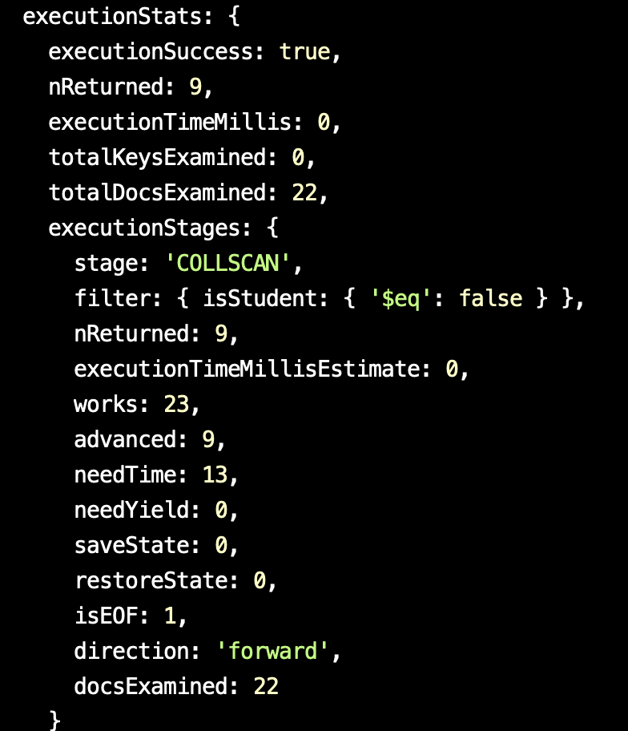
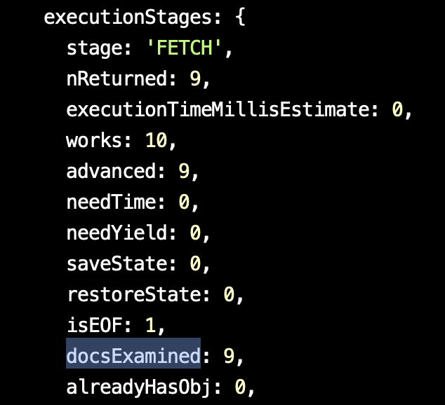

Documentations 
https://www.mongodb.com/docs/manual/reference/method/js-collection/

### 1. Launch Mongo Shell

Terminal မှာ `mongosh` ဆိုပြီး Testing စစမ်းလို့ရပါပြီ။

```
mongosh
```

ဒါပေမယ့် ကျွန်တော်တို့ ကိုယ့်ဘာသာကို Project တစ်ခုဆောက်ပြီး Cluster တစ်ခုရှိတယ်ဆိုရင်တော့ `connect`ကို နှိပ်မယ်။

 


`Connect` ပြီးသွားရင် ဒီလိုပေါ်လာလိမ့်မယ်။ အဲ့ဒီထဲကမှာ `Shell` ကိုရွေးမယ်။


`Shell` ကို ရွေးပြီးရင်တော့ Steps တွေအတိုင်းလုပ်ပေးရင်ရပါပြီ။


------------------------------------------------------------------------
### 2. `show` and `use` Databases

ကိုယ့် Project ထဲမှာ databases ဘယ်နှစ်ခုရှိလည်း ကြည့်လို့ရပါတယ်။

```
show dbs;
```


ကျွန်တော်ကတော့ `mongo_testing` database တစ်ခု ဆောက်ထားမို့လို့ အဲ့တာကိုပဲ သုံးလိုက်ပါမယ်။

```
use mongo_testing
```



------------------------------------------------------------------------

### 3. `create database` and `drop database`

database တစ်ခု create တာက သိပ်မခက်ပါဘူး။ ကိုယ်လိုချင်တဲ့ database ကို `use <option>` ဆိုပြီး သုံးပေးရုံပါပဲ။ ဥပမာ ကိုယ်က `books` database ကို အသစ်ဆောက်ချင်တယ်ဆိုရင် 

```
use books
```



Database တစ်ခုမှာ သူနဲ့ ဆိုင်တဲ့ Documents တွေရှိတယ်။

ဒါပေမယ့်  အခုဟာက Documents empty ဖြစ်နေတဲ့ အတွက် `show dbs` ဆိုပြီး ရိုက်ကြည့်ရင် ပေါ်လာအုံးမှာမဟုတ်ပါဘူး။ ဒါကြောင့် Collections တစ်ခုဆောက်ကြည့်ပါမယ်။

```
db.createCollection('biography')
```


ဒါဆိုရင်တော့ `show dbs;` ရိုက်ရင် ပေါ်လာပါပြီ။ 


Database ကို ပြန်ဖျက်မယ်ဆိုရင်လည်း ဆိုပြီး ပြန် Drop လို့ရပါတယ်။

```
db.dropDatabase();
```

------------------------------------------------------------------------

### 4. `Insert` and `InsertMany`

`mongo_testing` database ထဲမှာ `users` collections တစ်ခုတည်ဆောက်ပြီး စမ်းကြည့်ကြပါမယ်။


Insert လုပ်ကြည့်မယ်။ ပြီးရင် ဝင်သွားတဲ့ Data ပြန် ရှာမယ်ဆိုရင် find() ဆိုပြီး သုံးလို့ရပါတယ်။

```
db.users.insert({name: "Thuta Min Thway", age: 23, height: "5foot 9inches", isStudent: true})

db.users.find()
```

တစ်ကြိမ်ထဲမှာ Record အများကြီး ထည့်ချင်တယ်ဆိုရင် `insertMany()` သုံးလို့ရပါတယ်။ ဥပမာအနေနဲ့ Documents 20 လောက်ထည့်လိုက်ပါမယ်။ 

```
db.users.insertMany([
  { name: "Aung Aung", age: 25, height: "5foot 10inchs", isStudent: false },
  { name: "Su Su", age: 22, height: "5foot 5inchs", isStudent: true },
  { name: "Mya Mya", age: 24, height: "5foot 7inchs", isStudent: false },
  { name: "Ko Ko", age: 27, height: "6foot", isStudent: true },
  { name: "Hla Hla", age: 21, height: "5foot 4inchs", isStudent: true },
  { name: "Nay Win", age: 26, height: "5foot 8inchs", isStudent: false },
  { name: "Zaw Zaw", age: 23, height: "5foot 9inchs", isStudent: true },
  { name: "Aye Aye", age: 22, height: "5foot 6inchs", isStudent: true },
  { name: "Kyaw Kyaw", age: 29, height: "6foot 1inchs", isStudent: false },
  { name: "Moe Moe", age: 24, height: "5foot 7inchs", isStudent: true },
  { name: "Thandar", age: 28, height: "5foot 9inchs", isStudent: false },
  { name: "Lin Lin", age: 20, height: "5foot 3inchs", isStudent: true },
  { name: "Khin Khin", age: 25, height: "5foot 8inchs", isStudent: true },
  { name: "Thu Rein", age: 24, height: "6foot", isStudent: false },
  { name: "Phyo Phyo", age: 26, height: "5foot 7inchs", isStudent: false },
  { name: "Soe Soe", age: 23, height: "5foot 5inchs", isStudent: true },
  { name: "Htet Htet", age: 22, height: "5foot 9inchs", isStudent: true },
  { name: "Min Min", age: 27, height: "5foot 8inchs", isStudent: false },
  { name: "Tun Tun", age: 25, height: "6foot 2inchs", isStudent: true },
  { name: "Ei Ei", age: 23, height: "5foot 6inchs", isStudent: false }
]);

```

------------------------------------------------------------------------

### 5. `find` / `findOne` / `count` / `limit` / `toArray`

`find` ဆိုရင် အကုန်ရှာတာ

```
db.users.find()
```

`findOne` ဆိုရင် ပထမဆုံး ဝင်ထားတဲ့ document ကို ပြလိမ့်မယ်။

```
db.users.findOne()
```

`findOne` တို့ `find` တို့ကိုမှ အနောက်က parameter ထည့်ပြီး filter လို့ရပါသေးတယ်။ ဥပမာ အသက် 25 နှစ်နဲ့ သူတွေကို ရှာချင်တယ်ဆိုပါတော့

```
db.users.find({age: 25})
```

ဒီထဲကမှ `isStudent = true` ကိုပါ ဆက်ရှာကြည့်မယ်။

```
db.users.find({age: 25, isStudent: true})
```

ဒါဆို အသက် 25 နှစ်နဲ့ ကျောင်းသား ဘယ်နှစ်ယောက်ရှိလည်း တွက်ချင်တယ်ဆိုရင် `count` ကို သုံးလို့ရပါတယ်။

```
db.users.count({age: 25, isStudent: true})
```

ဘယ်နှစ်ခုပဲ လိုချင်လည်းဆိုပြီး သတ်မှတ်ချင်ရင် `limit` ကို သုံးလို့ရပါတယ်။ 

```
db.users.find().limit(10)
```

ဒါကိုမှ Array ပြောင်းချင်ရင် 

```
db.users.find().limit(10).toArray()
```

------------------------------------------------------------------------

### 6. Querying operators

အပေါ်က Data set ထဲကနေ အသက် 25 နှစ်အောက် ကျောင်းသားမဟုတ်တဲ့ သူတွေကို Query ဆွဲကြည့်ကြမယ်။

```
db.users.find({
	isStudent: false,
	age: { $lt: 25 }
})
```

- $gt - greater than
- $gte - greater than or equal to
- $lt - less than
- $lte - less than or equal to
- $eq - equals (usually not necessary)
- $ne - not equals
- $in - has the value in the array (MongoDB can store arrays and objects too!)
- $nin - does not have the value in the array

------------------------------------------------------------------------

### 7. Logical Query 
   
Documentation: https://www.mongodb.com/docs/manual/reference/operator/query-logical/

- $and ( Joins query clauses with a logical `AND` returns all documents that match the conditions of both clauses. )
  
- $not ( Inverts the effect of a query predicate and returns documents that do _not_ match the query predicate. )
  
- $nor ( Joins query clauses with a logical `NOR` returns all documents that fail to match both clauses. )
  
- $or ( Joins query clauses with a logical `OR` returns all documents that match the conditions of either clause. )

ဥပမာ အသက် 23 ကနေ 25 အထိ ရှိတဲ့ ကျောင်းသားတွေကို Query ဆွဲချင်ရင်

```
db.users.find({
   isStudent: true,
   $and: [{ age: { $gte: 23 } }, { age: { $lte: 25 } }]
})
```

------------------------------------------------------------------------

### 8. Sorting ( `sort` )

Sorting စီတဲ့နေရာမှာ Ascending ဆို (1) နဲ့ Descending ဆို (-1) ဆိုပြီး စီလို့ရပါတယ်။

- Ascending By Age

```
db.users.find().sort({ age: 1 })
```

- Descending By Age

```
db.users.find().sort({ age: -1 })
```

------------------------------------------------------------------------

### 9. Datatypes

Datatypes အစုံထည့်ပြီး Record တစ်ခု စမ်းကြည့်လို့ရပါတယ်။

```
db.users.insertOne({
  name: "Thuta Min Thway",                  // String
  age: 23,                                  // Number (Integer)
  height: 5.9,                              // Number (Double/Float)
  isStudent: true,                          // Boolean
  birthDate: new Date("2000-01-01"),        // Date
  address: {                                // Object (Embedded Document)
    street: "123 Main St", 
    city: "Yangon", 
    zipCode: 11011
  },
  hobbies: ["reading", "coding", "gaming"], // Array
  contact: null,                            // Null
  score: NumberLong("9223372036854775807"), // Number (Long)
  randomBytes: new BinData(0, "1234"),      // Binary Data
  idNumber: ObjectId(),                     // ObjectId
  grades: { math: Decimal128("85.75") },    // Decimal128
  extraInfo: undefined                      // Undefined (MongoDB treats undefined differently)
});

```

------------------------------------------------------------------------

### 10. Projection

Record ကို Filter တဲ့ အထိ အဆင်ပြေပြီ။ နောက်တစ်ဆင့် Projection ဆိုတာ ဆက်လေ့လာရအောင်။ 

```
db.users.find({query}{projection})
```

Projection က query ပြီးရင် Second parameter ဖြစ်တယ်။ သူက Documents ထဲမှာ ရှိတဲ့ Specific keys တွေကို filter လို့ရတယ်။ 

ဥပမာ ကျွန်တော်တို့မှာ 
1) name
2) age
3) height
4) isStudent ဆိုပြီးရှိတယ်။ ဒီထဲမှာမှ Name ပဲ ယူချင်တယ်ဆိုရင်

```
db.users.find({},{name: true})
```



ဒါပေမယ့် id ပါ တွဲပါနေတယ်။ မပါစေချင်ဘူးဆိုရင် 

```
db.users.find({},{_id: false, name: true})
```

> false အစား 0 လည်း သုံးလို့ရတယ်။
> true အစား 1 လည်း သုံးလို့ရတယ်။ 

------------------------------------------------------------------------

### 11. `updateOne` / `updateMany` / `delete`

အပေါ်က Insert လိုမျိုးပဲ သိပ်မကွာပါဘူး။ 

- `$set` ( ပြင် / ထည့်)

```
db.users.updateOne({_id: ObjectId("66e7b28c83faebe98283f728")}, {$set: {name: "tony Tun Tun"}})
```

>Update `$set` သုံးပြီး Update လိုက်မယ်။ `$set` တဲ့နေရာမှာ Documents ထဲမှာ မရှိတဲ့ key တစ်ခုခုကို ထည့်လိုက်ရင်တော့ အဲ့ Documents မှာ Key တစ်ခုအနေနဲ့ အသစ်ဝင်လာလိမ့်မယ်။

- `$unset` ( ဖျက် )

```
db.users.updateOne({_id: ObjectId("66e7b28c83faebe98283f728")}, {$unset: {name: ""}})
```

- `updateMany`

Example Use Case

```
collections.updateMany(<filter>, <update>)
```

- `deleteOne`

```
db.collection.deleteOne(
    <filter>,
    <update>
)
```

- `deleteMany`

```
db.collection.deleteMany(
    <filter>,
    <update>
)
```

------------------------------------------------------------------------

### 12. indexes

MongoDB မှာ Indexes တွေက Database ထဲက data တွေကို လွယ်ကူမြန်ဆန်စွာ ရှာဖွေဖို့ အရေးကြီးပါတယ်။ Indexes မထားတဲ့ Database ထဲမှာ ရှာဖွေမယ်ဆိုရင် Document တစ်ခုခြင်းစီကို scan (ခေါ်တာက table scan) လုပ်ရမယ်၊ အဲဒါကတော့ performance အရ ကျဆင်းစေပါတယ်။

ဒီထပ်နားလည်အောင်ထပ်ရှင်းရအောင်



ကျွန်တော်တို့မှာ `user` Collections ရှိတယ်။ အဲ့အထဲမှာလည်း Documents တွေ Create လိုက်ကြတယ်မလာ။ 

ဆိုပါတော့ အဲ့ဒီ Documents တွေထဲကမှ `isStudent = false` ဖြစ်နေတဲ့ သူတွေကိုရှာကြမယ်။ ဒါဆို `isStudent = false` ဖြစ်တဲ့ Documents တစ်ခုချင်းစီကို လိုက်ရှာရတော့မယ်။ 

Data နည်းရင် ကိစ္စမရှိပေမယ့် သောင်းဂဏန်း ၊ သိန်းဂဏန်းဆိုရင် Load ပိုကြာလာမယ်။ ဒါကြောင့် Indexing ကို သုံးကြမယ်။

သူ့လုပ်ဆောင်ပုံကို တစ်ချက် ကြည့်ရအောင်။ 



ကျွန်တော်တို့က `is_student` နေရာကို indexes ဆောက်ပေးလိုက်တယ်။ ( True သို့ False ပေါ့ ) 

အဲ့တာဆို နောက်တစ်ကြိမ် is_student ခေါ်တဲ့နေရာမှာ Document တိုင်းကို Loop ပတ်ပြီးသွားမရှာတော့ဘူး။ အဲ့ `is_student` index ပေးထားတဲ့ နေရာပဲ ထွက်လာလိမ့်မယ်။ ဘယ်လိုစမ်းကြည့်လို့ရမလဲဆက်ပြောရအောင်။


```
db.users.find({isStudent: false }).explain('executionStats');
```



ပုံထဲက executionStats တစ်ချက်ကြည့်ရအောင်။ 

ကျွန်တော်မှာက Record 22 ခုပဲ ရှိတယ်။ `TotalDocsExamined` မှာ ကြည့်လို့ရတယ်။  `nReturned: 9` ဆိုပြီး ပြန်လာတယ်။ ဒါက အပေါ်မှာ run ခဲ့တဲ့ `isStudent: true` ဖြစ်တဲ့ count။ 

တွေ့တဲ့ အတိုင်းပဲ ကျွန်တော်တို့ကို ပြန်ပေးမယ့် Return value 9 ခု အတွက် သူက Linear Search နဲ့ Record 22 ခုလုံးမှာ ရှာလိုက်ရတယ်။ ဒါဆို indexes ကို စသုံးမယ်။ 


```
db.users.getIndexes()

// [ { v: 2, key: { _id: 1 }, name: '_id_' } ]
```

MongoDB မှာက Default indexes တစ်ခုပါတယ်။ အပေါ်က `getIndexes()` ဆိုပြီး ရိုက်ကြည့်လို့ရတယ်။ ဒါဆို အသစ်တစ်ခု create ကြမယ်။

```
db.users.createIndex({ isStudent: 1 })
```

ဒါဆို `getIndexes()` ပြန်ရိုက်လိုက်ရင် အသစ်တိုးနေတာ တွေ့ရမှာပါ။

```
[
  { v: 2, key: { _id: 1 }, name: '_id_' },
  { v: 2, key: { isStudent: 1 }, name: 'isStudent_1' }
]
```

 ဒါဆိုရင် ကျွန်တော်တို့ indexes တည်ဆောက်တာ အဆင်ပြေသွားပြီ။ `executionStats` လေး ပြန် Run ကြည့်ရအောင်

```
db.users.find({isStudent: false }).explain('executionStats');
```



မြင်တဲ့ အတိုင်းပဲ `docsExamined` မှာ 9 ခုပဲ သွားဆွဲတော့တာ တွေ့ရမှာပါ။ 

Note: တစ်ခုနားလည်ရမှာက Indexing လုပ်တာတွေသည် Read မှာတော့ အတော်အဆင်ပြေတာ မှန်ပေမယ့် Write လုပ်တဲ့ အချိန်တွေမှာဆိုရင် ပိုပြီး ဆိုးသွားနိုင်ပါတယ်။

ဆိုလိုတာက Index ထောက်ထားတဲ့ Data ကို ပြန် write တဲ့အခါမှာ indexing ပါ ပြန်ပြီး အသစ်လုပ်ရပါတယ်။

Indexes တွေသုံးပုံသုံးနည်းတွေရှိသေးတယ်။ ဥပမာ 
1) **Single Field Index**: တစ်ခုတည်းသော field ပေါ်မှာ Index ထားတာပါ။ ဥပမာ `name` field ပေါ်မှာ Index ထားမယ်ဆိုရင် `name` ဖြင့် ရှာတဲ့ Queries တွေမြန်မှာပါ။
   
2) **Compound Index**: Field နှစ်ခု သို့မဟုတ် အများကြီးပေါ်မှာ Index ထားလို့ရတယ်။ ဒါက field အများကြီးကို အသုံးပြုတဲ့ Queries တွေကို မြန်ဆန်စေပါတယ်။
   
3) **Multikey Index**: Array type fields တွေအတွက် index ထားတဲ့ concept ဖြစ်ပါတယ်။ Array ထဲက အချက်အလက်တွေကို စီပြီး Index ချထားတဲ့ Queries တွေ အတွက် မြန်ဆန်စေပါတယ်။
   
4) **Text Index**: Text Field တွေမှာ စာသားတွေကို ရှာဖို့ Index တင်ရင် Text Index ကိုသုံးတတ်ကြပါတယ်။ အဓိကအားဖြင့် string type data တွေကို ရှာဖွေတဲ့ Queries များမှာ အသုံးဝင်ပါတယ်။

------------------------------------------------------------------------
