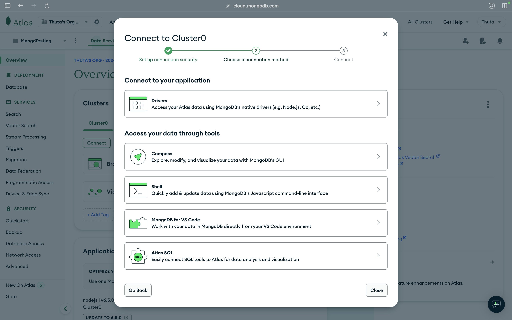
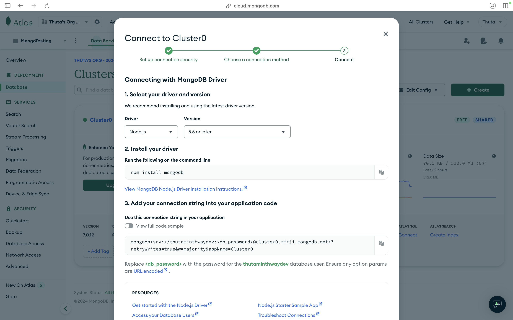

## Contents
1. Connecting with Nodejs

---

### 1. Connecting with Nodejs

ဒီအပိုင်းမှာတော့ Nodejs နဲ့ ချိတ်ပြီး သုံးကြည့်ပြီး Project တစ်ခုလုပ်ကြည့်သွားပါမယ်။ 

------------------------------------------------------------------------

### 2. စမ်းပြဖို့ Directory အသစ် တစ်ခု အရင်ဆောက်ပါလိုက်မယ်။

```
mkdir mongo-test
```

------------------------------------------------------------------------

### 3. Initialize NPM on a project.

```
npm init -y
```

package.json
```
{
  "name": "mongo_testing",
  "version": "1.0.0",
  "main": "index.js",
  "scripts": {
    "test": "echo \"Error: no test specified\" && exit 1"
  },
  "keywords": [],
  "author": "",
  "license": "ISC",
  "description": ""
}
```

------------------------------------------------------------------------

### 4. Install MongoDB Driver

```
npm install mongodb
```

------------------------------------------------------------------------

### 5. Get Connection
   
   - Click `Connect`
     
     
   
   - Click `Drivers` and Copy connection string
     
     
   
   - Create a file to export connection string
 
```
touch atlas_url.js
```

atlas_url.js
```
module.exports = url = "mongodb+srv://<username>:<db_password>@cluster0.zfrji.mongodb.net/?retryWrites=true&w=majority&appName=Cluster0"
```

   - Create `app.js`

app.js
```
const { MongoClient } = require('mongodb');

const connection_string = require('./atlas_connection_string');

  

const client = new MongoClient(connection_string);

const db_name = 'mongo_testing';

  

const connect = async () => {

	try {

	    await client.connect();

	    console.log(`Connected to the ${db_name} database...`);

	} catch (error) {

	    console.error('Error connecting to MongoDB...', error);

	}

}

  
connect();
```

output
```
Connected to the mongo_testing database...
```