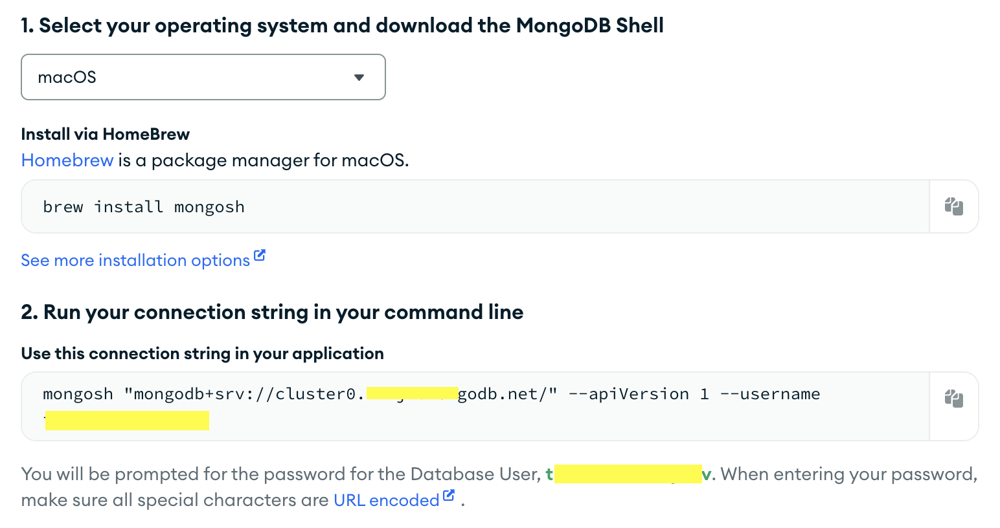

1. Launch Mongo Shell

Terminal မှာ `mongosh` ဆိုပြီး Testing စစမ်းလို့ရပါပြီ။

```
mongosh
```

ဒါပေမယ့် ကျွန်တော်တို့ ကိုယ့်ဘာသာကို Project တစ်ခုဆောက်ပြီး Cluster တစ်ခုရှိတယ်ဆိုရင်တော့ `connect`ကို နှိပ်မယ်။


`Connect` ပြီးသွားရင် ဒီလိုပေါ်လာလိမ့်မယ်။ အဲ့ဒီထဲကမှာ `Shell` ကိုရွေးမယ်။


`Shell` ကို ရွေးပြီးရင်တော့ Steps တွေအတိုင်းလုပ်ပေးရင်ရပါပြီ။



------------------------------------------------------------------------

2. `show` and `use` Databases

ကိုယ့် Project ထဲမှာ databases ဘယ်နှစ်ခုရှိလည်း ကြည့်လို့ရပါတယ်။

```
show dbs;
```


ကျွန်တော်ကတော့ `mongo_testing` database တစ်ခု ဆောက်ထားမို့လို့ အဲ့တာကိုပဲ သုံးလိုက်ပါမယ်။

```
use mongo_testing
```


------------------------------------------------------------------------

3. `create database` and `drop database`

database တစ်ခု create တာက သိပ်မခက်ပါဘူး။ ကိုယ်လိုချင်တဲ့ database ကို `use <option>` ဆိုပြီး သုံးပေးရုံပါပဲ။ ဥပမာ ကိုယ်က `books` database ကို အသစ်ဆောက်ချင်တယ်ဆိုရင် 

```
use books
```


Database တစ်ခုမှာ သူနဲ့ ဆိုင်တဲ့ Documents တွေရှိတယ်။

ဒါပေမယ့်  အခုဟာက Documents empty ဖြစ်နေတဲ့ အတွက် `show dbs` ဆိုပြီး ရိုက်ကြည့်ရင် ပေါ်လာအုံးမှာမဟုတ်ပါဘူး။ ဒါကြောင့် Collections တစ်ခုဆောက်ကြည့်ပါမယ်။

```
db.createCollection('biography')
```


ဒါဆိုရင်တော့ `show dbs;` ရိုက်ရင် ပေါ်လာပါပြီ။ 


Database ကို ပြန်ဖျက်မယ်ဆိုရင်လည်း ဆိုပြီး ပြန် Drop လို့ရပါတယ်။

```
db.dropDatabase();
```

------------------------------------------------------------------------
