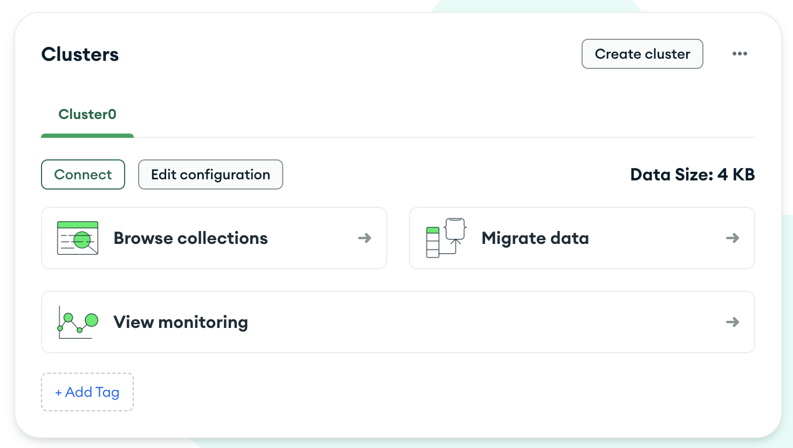
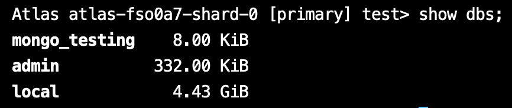
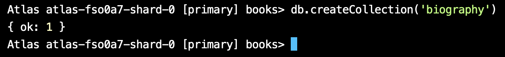
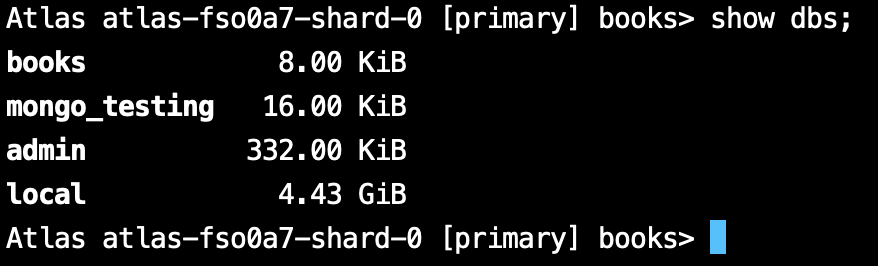

Documentations 
https://www.mongodb.com/docs/manual/reference/method/js-collection/

1. Launch Mongo Shell

Terminal မှာ `mongosh` ဆိုပြီး Testing စစမ်းလို့ရပါပြီ။

```
mongosh
```

ဒါပေမယ့် ကျွန်တော်တို့ ကိုယ့်ဘာသာကို Project တစ်ခုဆောက်ပြီး Cluster တစ်ခုရှိတယ်ဆိုရင်တော့ `connect`ကို နှိပ်မယ်။



`Connect` ပြီးသွားရင် ဒီလိုပေါ်လာလိမ့်မယ်။ အဲ့ဒီထဲကမှာ `Shell` ကိုရွေးမယ်။


`Shell` ကို ရွေးပြီးရင်တော့ Steps တွေအတိုင်းလုပ်ပေးရင်ရပါပြီ။


------------------------------------------------------------------------

2. `show` and `use` Databases

ကိုယ့် Project ထဲမှာ databases ဘယ်နှစ်ခုရှိလည်း ကြည့်လို့ရပါတယ်။

```
show dbs;
```



ကျွန်တော်ကတော့ `mongo_testing` database တစ်ခု ဆောက်ထားမို့လို့ အဲ့တာကိုပဲ သုံးလိုက်ပါမယ်။

```
use mongo_testing
```


------------------------------------------------------------------------

3. `create database` and `drop database`

database တစ်ခု create တာက သိပ်မခက်ပါဘူး။ ကိုယ်လိုချင်တဲ့ database ကို `use <option>` ဆိုပြီး သုံးပေးရုံပါပဲ။ ဥပမာ ကိုယ်က `books` database ကို အသစ်ဆောက်ချင်တယ်ဆိုရင် 

```
use books
```


Database တစ်ခုမှာ သူနဲ့ ဆိုင်တဲ့ Documents တွေရှိတယ်။

ဒါပေမယ့်  အခုဟာက Documents empty ဖြစ်နေတဲ့ အတွက် `show dbs` ဆိုပြီး ရိုက်ကြည့်ရင် ပေါ်လာအုံးမှာမဟုတ်ပါဘူး။ ဒါကြောင့် Collections တစ်ခုဆောက်ကြည့်ပါမယ်။

```
db.createCollection('biography')
```



ဒါဆိုရင်တော့ `show dbs;` ရိုက်ရင် ပေါ်လာပါပြီ။ 



Database ကို ပြန်ဖျက်မယ်ဆိုရင်လည်း ဆိုပြီး ပြန် Drop လို့ရပါတယ်။

```
db.dropDatabase();
```

------------------------------------------------------------------------

4. `Insert` and `InsertMany`

`mongo_testing` database ထဲမှာ `users` collections တစ်ခုတည်ဆောက်ပြီး စမ်းကြည့်ကြပါမယ်။


Insert လုပ်ကြည့်မယ်။ ပြီးရင် ဝင်သွားတဲ့ Data ပြန် ရှာမယ်ဆိုရင် find() ဆိုပြီး သုံးလို့ရပါတယ်။

```
db.users.insert({name: "Thuta Min Thway", age: 23, height: "5foot 9inches", isStudent: true})

db.users.find()
```

တစ်ကြိမ်ထဲမှာ Record အများကြီး ထည့်ချင်တယ်ဆိုရင် `insertMany()` သုံးလို့ရပါတယ်။ ဥပမာအနေနဲ့ Documents 20 လောက်ထည့်လိုက်ပါမယ်။ 

```
db.users.insertMany([
  { name: "Aung Aung", age: 25, height: "5foot 10inchs", isStudent: false },
  { name: "Su Su", age: 22, height: "5foot 5inchs", isStudent: true },
  { name: "Mya Mya", age: 24, height: "5foot 7inchs", isStudent: false },
  { name: "Ko Ko", age: 27, height: "6foot", isStudent: true },
  { name: "Hla Hla", age: 21, height: "5foot 4inchs", isStudent: true },
  { name: "Nay Win", age: 26, height: "5foot 8inchs", isStudent: false },
  { name: "Zaw Zaw", age: 23, height: "5foot 9inchs", isStudent: true },
  { name: "Aye Aye", age: 22, height: "5foot 6inchs", isStudent: true },
  { name: "Kyaw Kyaw", age: 29, height: "6foot 1inchs", isStudent: false },
  { name: "Moe Moe", age: 24, height: "5foot 7inchs", isStudent: true },
  { name: "Thandar", age: 28, height: "5foot 9inchs", isStudent: false },
  { name: "Lin Lin", age: 20, height: "5foot 3inchs", isStudent: true },
  { name: "Khin Khin", age: 25, height: "5foot 8inchs", isStudent: true },
  { name: "Thu Rein", age: 24, height: "6foot", isStudent: false },
  { name: "Phyo Phyo", age: 26, height: "5foot 7inchs", isStudent: false },
  { name: "Soe Soe", age: 23, height: "5foot 5inchs", isStudent: true },
  { name: "Htet Htet", age: 22, height: "5foot 9inchs", isStudent: true },
  { name: "Min Min", age: 27, height: "5foot 8inchs", isStudent: false },
  { name: "Tun Tun", age: 25, height: "6foot 2inchs", isStudent: true },
  { name: "Ei Ei", age: 23, height: "5foot 6inchs", isStudent: false }
]);

```

------------------------------------------------------------------------

5. `find` / `findOne` / `count` / `limit` / `toArray`

`find` ဆိုရင် အကုန်ရှာတာ

```
db.users.find()
```

`findOne` ဆိုရင် ပထမဆုံး ဝင်ထားတဲ့ document ကို ပြလိမ့်မယ်။

```
db.users.findOne()
```

`findOne` တို့ `find` တို့ကိုမှ အနောက်က parameter ထည့်ပြီး filter လို့ရပါသေးတယ်။ ဥပမာ အသက် 25 နှစ်နဲ့ သူတွေကို ရှာချင်တယ်ဆိုပါတော့

```
db.users.find({age: 25})
```

ဒီထဲကမှ `isStudent = true` ကိုပါ ဆက်ရှာကြည့်မယ်။

```
db.users.find({age: 25, isStudent: true})
```

ဒါဆို အသက် 25 နှစ်နဲ့ ကျောင်းသား ဘယ်နှစ်ယောက်ရှိလည်း တွက်ချင်တယ်ဆိုရင် `count` ကို သုံးလို့ရပါတယ်။

```
db.users.count({age: 25, isStudent: true})
```

ဘယ်နှစ်ခုပဲ လိုချင်လည်းဆိုပြီး သတ်မှတ်ချင်ရင် `limit` ကို သုံးလို့ရပါတယ်။ 

```
db.users.find().limit(10)
```

ဒါကိုမှ Array ပြောင်းချင်ရင် 

```
db.users.find().limit(10).toArray()
```

------------------------------------------------------------------------

6. Querying operators

အပေါ်က Data set ထဲကနေ အသက် 25 နှစ်အောက် ကျောင်းသားမဟုတ်တဲ့ သူတွေကို Query ဆွဲကြည့်ကြမယ်။

```
db.users.find({
	isStudent: false,
	age: { $lt: 25 }
})
```

- $gt - greater than
- $gte - greater than or equal to
- $lt - less than
- $lte - less than or equal to
- $eq - equals (usually not necessary)
- $ne - not equals
- $in - has the value in the array (MongoDB can store arrays and objects too!)
- $nin - does not have the value in the array

------------------------------------------------------------------------

7. Logical Query 
   
Documentation: https://www.mongodb.com/docs/manual/reference/operator/query-logical/

- $and ( Joins query clauses with a logical `AND` returns all documents that match the conditions of both clauses. )
  
- $not ( Inverts the effect of a query predicate and returns documents that do _not_ match the query predicate. )
  
- $nor ( Joins query clauses with a logical `NOR` returns all documents that fail to match both clauses. )
  
- $or ( Joins query clauses with a logical `OR` returns all documents that match the conditions of either clause. )

ဥပမာ အသက် 23 ကနေ 25 အထိ ရှိတဲ့ ကျောင်းသားတွေကို Query ဆွဲချင်ရင်

```
db.users.find({
   isStudent: true,
   $and: [{ age: { $gte: 23 } }, { age: { $lte: 25 } }]
})
```

------------------------------------------------------------------------

8. Sorting ( `sort` )

Sorting စီတဲ့နေရာမှာ Ascending ဆို (1) နဲ့ Descending ဆို (-1) ဆိုပြီး စီလို့ရပါတယ်။

- Ascending By Age

```
db.users.find().sort({ age: 1 })
```

- Descending By Age

```
db.users.find().sort({ age: -1 })
```

------------------------------------------------------------------------

9. Datatypes

Datatypes အစုံထည့်ပြီး Record တစ်ခု စမ်းကြည့်လို့ရပါတယ်။

```
db.users.insertOne({
  name: "Thuta Min Thway",                  // String
  age: 23,                                  // Number (Integer)
  height: 5.9,                              // Number (Double/Float)
  isStudent: true,                          // Boolean
  birthDate: new Date("2000-01-01"),        // Date
  address: {                                // Object (Embedded Document)
    street: "123 Main St", 
    city: "Yangon", 
    zipCode: 11011
  },
  hobbies: ["reading", "coding", "gaming"], // Array
  contact: null,                            // Null
  score: NumberLong("9223372036854775807"), // Number (Long)
  randomBytes: new BinData(0, "1234"),      // Binary Data
  idNumber: ObjectId(),                     // ObjectId
  grades: { math: Decimal128("85.75") },    // Decimal128
  extraInfo: undefined                      // Undefined (MongoDB treats undefined differently)
});

```

------------------------------------------------------------------------

