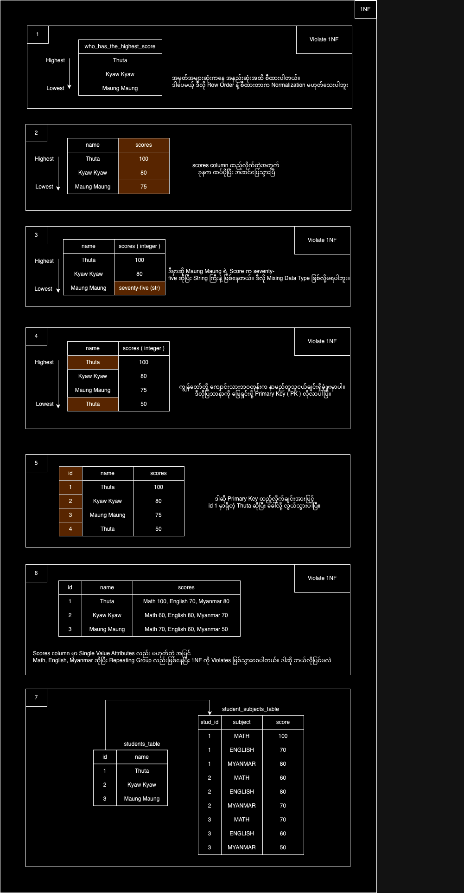
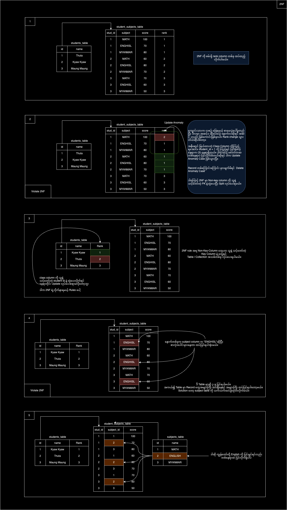

Content 
1. Normalization

------------------------------------------------------------------------

1. Normalization
   
   **Normalize** နဲ့ **Denormalize** ဆိုတာက data modeling နဲ့ပတ်သက်တဲ့ အဓိက concepts တွေဖြစ်ပါတယ်။
   
   MySQL, PostgreSQL တို့ စတဲ့ Relational Databases တွေနဲ့ အလုပ်လုပ်ဖူးတဲ့ သူတွေဆို Normalization ဆိုတဲ့ အခေါ်အဝေါ်နဲ့ ကြားဖူး / ရင်းနှီးပါလိမ့်မယ်။ ဒါဆို Normalization ဆိုတာကို ဘာလဲ တစ်ချက် အတူတူလေ့လာကြည့်ရအောင်။
   
   1. What is Normalization?
      
      > ****Normalization**** is the process of minimizing ****redundancy**** from a relation or set of relations
      
       Normalization ဆိုတာက Data Redundancy လျော့ချဖို့ အတွက် Data တွေကို သီးသန့် Collections / Table တွေခွဲပြီး Primary Key တွေ Foreign Key တွေ သုံးပြီး သိမ်းလိုက်တာ ဖြစ်ပါတယ်။ ဒါဆို Normal Form (NF) တွေကို ဆက်လေ့လာရအောင်။ 
       
	1. Normal Form 
          
          **Normal Forms** (NF) ဆိုတာ Relational Database Design မှာ data ကို proper structure ထားဖို့အသုံးပြုတဲ့ **guidelines** မျိုးဖြစ်ပါတယ်။ အဓိကရည်ရွယ်ချက်က data redundancy နဲ့ anomalies (အမှားအယွင်း) ကိုလျှော့ချပြီး, တိကျမှန်ကန်ဖို့ ပါ။ Normal form ကို အဆင့်အလိုက်ခွဲကြည့်လို့ရပါတယ်။
          
          1. ****First Normal Form (1NF)****
             
             Normalization မှာ အခြေခံအကျဆုံး form ဖြစ်ပြီး Data field တစ်ခုစီမှာ single value တွေသာ ရှိရမယ်။ ရိုးရိုး tabular format ဖြစ်ရမယ်။ Repeating groups (data redundancy) မရှိရ။ Column တစ်ခုအတွင်းမှာ Mixing Data Type မဖြစ်ရ။ ပိုပြီး နားလည်အောင် ဥပမာလေးတွေနဲ့ သွားကြည့်ပါမယ်။ 
              
		  
		  2. ****Second Normal Form (2NF)****
		     
		     All Data must depend on the Primary Key.
		     
		     2NF Rule ကကျတော့ ကိုယ့် Table မှာ Non-Key-columns ( Key လို့ သတ်မှတ်လို့မရတဲ့ ) ရှိလား အရင်ရှာမယ်။ အဲ့ဒီ Non-Key-columns နဲ့ Key Columns ( PK or FK ) တွေနဲ့ သင့်တော်လား။ သင့်တော်ရင် Table / Collections တစ်ခုခွဲပြီး သပ်သပ်စီ ထားပေးမယ်။ ဥပမာ ပုံကြည့်ရအောင်
		     
		     
		     
          1. ****Third Normal Form (3NF)****
             
             The Primary Key must fully depend all Non-Key columns and Non-Key columns must not depend on any other Key.
             
             
             
          2. ****Fourth Normal Form (4NF)****
          3. ****Fifth Normal Form (5NF)****
   
   

