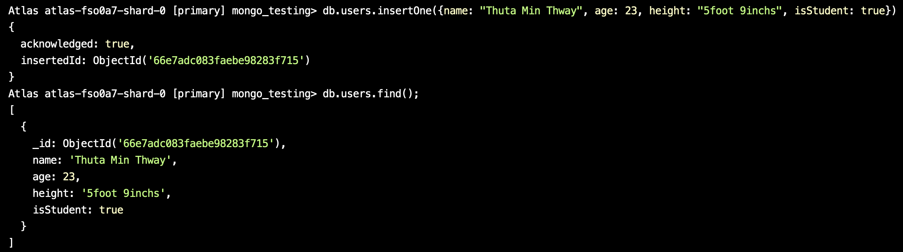

# MongoDB Documentation

  

## 1. Launch Mongo Shell

  

To start the MongoDB shell, simply run the following command in your terminal:

  

```bash

mongosh

```

  

If you already have a project and cluster set up, click on ****Connect****:

  


  

After connecting, select ****Shell**** from the options:

  


  

Follow the steps to proceed:

  


  

---

  

## 2. Show and Use Databases

  

To view all databases in your project, use:

  

```bash

show dbs;

```

  


  

To switch to a specific database (e.g., `mongo_testing`):

  

```bash

use mongo_testing

```

  


  

---

  

## 3. Create and Drop a Database

  

Creating a new database is simple. Just use the following command:

  

```bash

use books

```

  


  

If the database is empty, it won’t appear in `show dbs` until a collection is added:

  

```bash

db.createCollection('biography')

```

  


  

Once a collection is created, the database will be visible:

  

```bash

show dbs;

```

  


  

To drop a database:

  

```bash

db.dropDatabase();

```

  

---

  

## 4. Insert and InsertMany

  

Let's create a `users` collection in the `mongo_testing` database and insert a record:

  

```bash

db.users.insert({name: "Thuta Min Thway", age: 23, height: "5foot 9inches", isStudent: true})

```

  

To view inserted data:

  

```bash

db.users.find()

```

  

To insert multiple records at once, use `insertMany()`:

  

```bash

db.users.insertMany([

  { name: "Aung Aung", age: 25, height: "5foot 10inches", isStudent: false },

  { name: "Su Su", age: 22, height: "5foot 5inches", isStudent: true },

  // More records...

]);

```

  



  

---

  

## 5. Find, FindOne, Count, Limit, and ToArray

  

To find all records:

  

```bash

db.users.find()

```

  

To find a single record:

  

```bash

db.users.findOne()

```

  

You can filter records with parameters. For example, to find users aged 25:

  

```bash

db.users.find({age: 25})

```

  

To further filter:

  

```bash

db.users.find({age: 25, isStudent: true})

```

  

To count records:

  

```bash

db.users.count({age: 25, isStudent: true})

```

  

To limit the number of records returned:

  

```bash

db.users.find().limit(10)

```

  

To return the results as an array:

  

```bash

db.users.find().limit(10).toArray()

```

  

---

  

## 6. Querying Operators

  

To find students under 25 who are not students:

  

```bash

db.users.find({

  isStudent: false,

  age: { $lt: 25 }

})

```

  

Common operators:

- `$gt`: greater than

- `$gte`: greater than or equal to

- `$lt`: less than

- `$lte`: less than or equal to

- `$eq`: equals (not usually needed)

- `$ne`: not equals

- `$in`: value exists in array

- `$nin`: value does not exist in array

  

---

  

## 7. Logical Queries

  

Documentation: [Logical Query Operators](https://www.mongodb.com/docs/manual/reference/operator/query-logical/)

  

- `$and`: Joins query clauses with a logical AND.

- `$not`: Inverts the effect of a query predicate.

- `$nor`: Joins query clauses with a logical NOR.

- `$or`: Joins query clauses with a logical OR.

  

For example, to find students aged 23 to 25:

  

```bash

db.users.find({

  isStudent: true,

  $and: [{ age: { $gte: 23 } }, { age: { $lte: 25 } }]

})

```

  

---

  

## 8. Sorting

  

To sort by age in ascending order:

  

```bash

db.users.find().sort({ age: 1 })

```

  

To sort by age in descending order:

  

```bash

db.users.find().sort({ age: -1 })

```

  

---

  

## 9. Data Types

  

MongoDB supports various data types. Here's an example of inserting a record with multiple data types:

  

```bash

db.users.insertOne({

  name: "Thuta Min Thway",                  // String

  age: 23,                                  // Integer

  height: 5.9,                              // Double/Float

  isStudent: true,                          // Boolean

  birthDate: new Date("2000-01-01"),        // Date

  address: {                                // Object (Embedded Document)

    street: "123 Main St", 

    city: "Yangon", 

    zipCode: 11011

  },

  hobbies: ["reading", "coding", "gaming"], // Array

  contact: null,                            // Null

  score: NumberLong("9223372036854775807"), // Long

  randomBytes: new BinData(0, "1234"),      // Binary Data

  idNumber: ObjectId(),                     // ObjectId

  grades: { math: Decimal128("85.75") },    // Decimal128

  extraInfo: undefined                      // Undefined

});

```

  

---

  

## 10. Projection

  

To filter specific fields from the returned records:

  

```bash

db.users.find({}, {name: true})

```

  

To exclude `_id`:

  

```bash

db.users.find({}, {_id: false, name: true})

```

  

---

  

## 11. Update and Delete

  

To update a record:

  

```bash

db.users.updateOne({_id: ObjectId("66e7b28c83faebe98283f728")}, {$set: {name: "Tony Tun Tun"}})

```

  

---

  

****Note:**** For more details, refer to the official [MongoDB documentation](https://www.mongodb.com/docs/manual/reference/method/js-collection/).